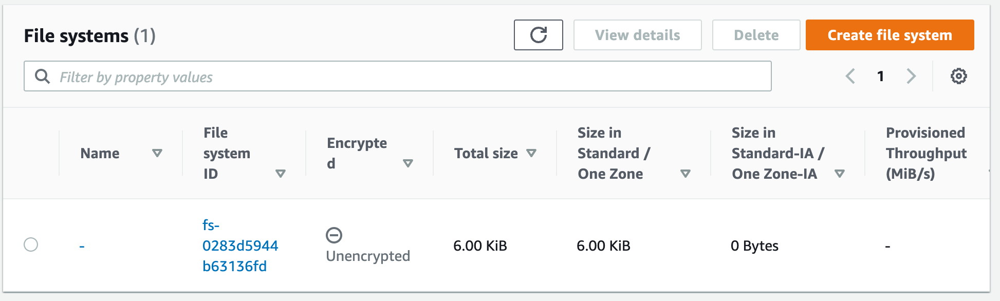
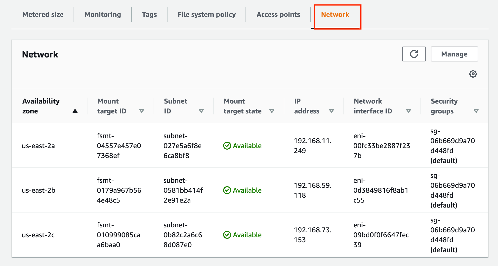

# Elastic Filesystem Service

## Configure Identity Access Management 
EKS requires specific permissions to mount storage volumes. 

### Associate OIDC provider with the cluster 
Run the following command, replacing `CLUSTER_NAME`
```sh
eksctl utils associate-iam-oidc-provider --region=us-east-2 --cluster=CLUSTER_NAME --approve
```

### Create IAM policies
Create an IAM policy and assign it to an IAM role. The policy will allow the Amazon EFS driver to interact with your file system.
```sh
curl -o iam-policy-example.json https://raw.githubusercontent.com/kubernetes-sigs/aws-efs-csi-driver/v1.3.2/docs/iam-policy-example.json
```

```sh
aws iam create-policy \
    --policy-name AmazonEKS_EFS_CSI_Driver_Policy \
    --policy-document file://iam-policy-example.json
```

Create an IAM role and attach the IAM policy to it. Annotate the Kubernetes service account with the IAM role ARN and the IAM role with the Kubernetes service account name.
You can find the **Account ID** by clicking the student account name in the top right hand corner (e.g. aws-student-56)
**Replace CLUSTER_NAME and Account ID**
```sh
eksctl create iamserviceaccount \
    --name efs-csi-controller-sa \
    --namespace kube-system \
    --cluster CLUSTER_NAME \
    --attach-policy-arn arn:aws:iam::<Account ID>:policy/AmazonEKS_EFS_CSI_Driver_Policy \
    --approve \
    --override-existing-serviceaccounts \
    --region us-east-2
```

## Install the EFS CSI driver
Add the Helm repo
```sh
helm repo add aws-efs-csi-driver https://kubernetes-sigs.github.io/aws-efs-csi-driver/
```

Update the repo
```sh
helm repo update
```

Install the chart. 
```sh
helm upgrade -i aws-efs-csi-driver aws-efs-csi-driver/aws-efs-csi-driver \
    --namespace kube-system \
    --set image.repository=602401143452.dkr.ecr.us-east-2.amazonaws.com/eks/aws-efs-csi-driver \
    --set controller.serviceAccount.create=false \
    --set controller.serviceAccount.name=efs-csi-controller-sa
```

## Create EFS Mount points
An EFS file system may be created and configured either from the AWS Management Console or using AWS CLI. An EFS file system may be accessed concurrently by worker nodes (EC2 instances) running inside the EKS cluster VPC. Instances connect to a file system by using a network interface called a mount target.

Retrieve the VPC ID that your cluster is in and store it in a variable for use in a later step. Replace `<cluster-name>` (including `<>`) with your cluster name.

```sh
vpc_id=$(aws eks describe-cluster \
    --name <cluster-name> \
    --query "cluster.resourcesVpcConfig.vpcId" \
    --output text)
```

Retrieve the CIDR range for your cluster's VPC and store it in a variable for use in a later step.

```sh
cidr_range=$(aws ec2 describe-vpcs \
    --vpc-ids $vpc_id \
    --query "Vpcs[].CidrBlock" \
    --output text)
```

Create a security group with an inbound rule that allows inbound NFS traffic for your Amazon EFS mount points.
Create a security group. 
```sh
security_group_id=$(aws ec2 create-security-group \
    --group-name MyEfsSecurityGroup \
    --description "My EFS security group" \
    --vpc-id $vpc_id \
    --output text)
```

Create an inbound rule that allows inbound NFS traffic from the CIDR for your cluster's VPC.

```sh
aws ec2 authorize-security-group-ingress \
    --group-id $security_group_id \
    --protocol tcp \
    --port 2049 \
    --cidr $cidr_range
```


Now, create an EFS file system.
```sh
file_system_id=$(aws efs create-file-system \
    --region us-east-2 \
    --performance-mode generalPurpose \
    --query 'FileSystemId' \
    --output text)
```

Create mount targets.

Determine the IP address of your cluster nodes. 
```sh
kubectl get nodes --show-labels
```

You can see the zone they are in by looking at the tags. 
`failure-domain.beta.kubernetes.io/zone=us-east-2a`
Output:
```
NAME                                           STATUS   ROLES    AGE   VERSION               LABELS
ip-192-168-24-64.us-east-2.compute.internal    Ready    <none>   96m   v1.20.10-eks-3bcdcd   alpha.eksctl.io/cluster-name=eks-cluster-eks-cluster-jrs,alpha.eksctl.io/nodegroup-name=standard-workers,beta.kubernetes.io/arch=amd64,beta.kubernetes.io/instance-type=t3.medium,beta.kubernetes.io/os=linux,eks.amazonaws.com/capacityType=ON_DEMAND,eks.amazonaws.com/nodegroup-image=ami-0abbd217a24c16672,eks.amazonaws.com/nodegroup=standard-workers,eks.amazonaws.com/sourceLaunchTemplateId=lt-0e196232742fb6006,eks.amazonaws.com/sourceLaunchTemplateVersion=1,failure-domain.beta.kubernetes.io/region=us-east-2,failure-domain.beta.kubernetes.io/zone=us-east-2a,kubernetes.io/arch=amd64,kubernetes.io/hostname=ip-192-168-24-64.us-east-2.compute.internal,kubernetes.io/os=linux,node.kubernetes.io/instance-type=t3.medium,topology.kubernetes.io/region=us-east-2,topology.kubernetes.io/zone=us-east-2a
ip-192-168-60-215.us-east-2.compute.internal   Ready    <none>   96m   v1.20.10-eks-3bcdcd   alpha.eksctl.io/cluster-name=eks-cluster-eks-cluster-jrs,alpha.eksctl.io/nodegroup-name=standard-workers,beta.kubernetes.io/arch=amd64,beta.kubernetes.io/instance-type=t3.medium,beta.kubernetes.io/os=linux,eks.amazonaws.com/capacityType=ON_DEMAND,eks.amazonaws.com/nodegroup-image=ami-0abbd217a24c16672,eks.amazonaws.com/nodegroup=standard-workers,eks.amazonaws.com/sourceLaunchTemplateId=lt-0e196232742fb6006,eks.amazonaws.com/sourceLaunchTemplateVersion=1,failure-domain.beta.kubernetes.io/region=us-east-2,failure-domain.beta.kubernetes.io/zone=us-east-2b,kubernetes.io/arch=amd64,kubernetes.io/hostname=ip-192-168-60-215.us-east-2.compute.internal,kubernetes.io/os=linux,node.kubernetes.io/instance-type=t3.medium,topology.kubernetes.io/region=us-east-2,topology.kubernetes.io/zone=us-east-2b
ip-192-168-67-233.us-east-2.compute.internal   Ready    <none>   96m   v1.20.10-eks-3bcdcd   alpha.eksctl.io/cluster-name=eks-cluster-eks-cluster-jrs,alpha.eksctl.io/nodegroup-name=standard-workers,beta.kubernetes.io/arch=amd64,beta.kubernetes.io/instance-type=t3.medium,beta.kubernetes.io/os=linux,eks.amazonaws.com/capacityType=ON_DEMAND,eks.amazonaws.com/nodegroup-image=ami-0abbd217a24c16672,eks.amazonaws.com/nodegroup=standard-workers,eks.amazonaws.com/sourceLaunchTemplateId=lt-0e196232742fb6006,eks.amazonaws.com/sourceLaunchTemplateVersion=1,failure-domain.beta.kubernetes.io/region=us-east-2,failure-domain.beta.kubernetes.io/zone=us-east-2c,kubernetes.io/arch=amd64,kubernetes.io/hostname=ip-192-168-67-233.us-east-2.compute.internal,kubernetes.io/os=linux,node.kubernetes.io/instance-type=t3.medium,topology.kubernetes.io/region=us-east-2,topology.kubernetes.io/zone=us-east-2c
```

Determine the IDs of the subnets in your VPC and which Availability Zone the subnet is in.
```sh
aws ec2 describe-subnets \
    --filters "Name=vpc-id,Values=$vpc_id" \
    --query 'Subnets[*].{SubnetId: SubnetId,AvailabilityZone: AvailabilityZone,CidrBlock: CidrBlock}' \
    --output table
```

Output:
```
|                           DescribeSubnets                          |
+------------------+--------------------+----------------------------+
| AvailabilityZone |     CidrBlock      |         SubnetId           |
+------------------+--------------------+----------------------------+
|  us-west-2c      |  192.168.128.0/19  |  subnet-EXAMPLE6e421a0e97  |
|  us-west-2b      |  192.168.96.0/19   |  subnet-EXAMPLEd0503db0ec  |
|  us-west-2c      |  192.168.32.0/19   |  subnet-EXAMPLEe2ba886490  |
|  us-west-2b      |  192.168.0.0/19    |  subnet-EXAMPLE123c7c5182  |
|  us-west-2a      |  192.168.160.0/19  |  subnet-EXAMPLE0416ce588p  |
|  us-west-2a      |  192.168.64.0/19   |  subnet-EXAMPLE12c68ea7fb  |
+------------------+--------------------+----------------------------+
```


Add mount targets for the subnets that your nodes are in. From the output in the previous two steps, the cluster has one node with an IP address of `192.168.56.0`. That IP address is within the `CidrBlock` of the subnet with the ID `subnet-EXAMPLEe2ba886490`. As a result, the following command creates a mount target for the subnet the node is in. I

Run the command once for each node , replacing `subnet-EXAMPLEe2ba886490` with the appropriate subnet ID.

```sh
aws efs create-mount-target \
    --file-system-id $file_system_id \
    --subnet-id subnet-EXAMPLEe2ba886490 \
    --security-groups $security_group_id
```


Check the **LifeCycleState** of the file system using the following command and wait until it changes from **creating** to **available** before you proceed to the next step.

```sh
aws efs describe-file-systems --file-system-id $file_system_id
```


You may also check on the status of mount targets from the EFS Dashboard on the AWS Management Console. Select the file system you just created:




Then select the **Network** tab on the right side



Confirm the **target state** for all mounts is `available`

Kubernetes supports Static Provisioning of volumes, as well as Dynamic provisioning. 


## Static: Create a persistent volume
Now we will deploy a persistent volume using EFS

Clone the repository to your system.
```sh
git clone https://github.com/kubernetes-sigs/aws-efs-csi-driver.git
```

Navigate to the `multiple_pods` example directory.
```sh
cd aws-efs-csi-driver/examples/kubernetes/multiple_pods/
```

Echo your File system ID
```sh
echo $file_system_id
```

Outpu:
```
fs-0467603defff43caa
```

Edit the `specs/pv.yaml` file and replace the `volumeHandle` value with your Amazon EFS file system ID from above.

```yaml
apiVersion: v1
kind: PersistentVolume
metadata:
  name: efs-pv
spec:
  capacity:
    storage: 5Gi
  volumeMode: Filesystem
  accessModes:
    - ReadWriteMany
  persistentVolumeReclaimPolicy: Retain
  storageClassName: efs-sc
  csi:
    driver: efs.csi.aws.com
    volumeHandle: fs-<582a03f3>
```

Deploy the `efs-sc` storage class, `efs-claim` persistent volume claim, and `efs-pv` persistent volume from the specs directory.

```sh
kubectl apply -f specs/pv.yaml
kubectl apply -f specs/claim.yaml
kubectl apply -f specs/storageclass.yaml
```

List the persistent volumes in the `default` namespace. Look for a persistent volume with the `default/efs-claim` claim.

```sh
kubectl get pv 
```

Output:
```
NAME     CAPACITY   ACCESS MODES   RECLAIM POLICY   STATUS   CLAIM               STORAGECLASS   REASON   AGE
efs-pv   5Gi        RWX            Retain           Bound    default/efs-claim   efs-sc                  61s
```

Don't proceed to the next step until the `STATUS` is `Bound`.

Deploy the `app1` and `app2` sample applications from the specs directory.

```sh
kubectl apply -f specs/pod1.yaml
kubectl apply -f specs/pod2.yaml
```

Watch the pods  and wait for the `app1` and `app2` pods' `STATUS` to become `Running`.

```sh
kubectl get pods
```

Describe the persistent volume.

```sh
kubectl describe pv efs-pv
```

Output:
```
Name:            efs-pv
Labels:          none
Annotations:     kubectl.kubernetes.io/last-applied-configuration:
                   {"apiVersion":"v1","kind":"PersistentVolume","metadata":{"annotations":{},"name":"efs-pv"},"spec":{"accessModes":["ReadWriteMany"],"capaci...
                 pv.kubernetes.io/bound-by-controller: yes
Finalizers:      [kubernetes.io/pv-protection]
StorageClass:    efs-sc
Status:          Bound
Claim:           default/efs-claim
Reclaim Policy:  Retain
Access Modes:    RWX
VolumeMode:      Filesystem
Capacity:        5Gi
Node Affinity:   none
Message:
Source:
    Type:              CSI (a Container Storage Interface (CSI) volume source)
    Driver:            efs.csi.aws.com
    VolumeHandle:      fs-582a03f3
    ReadOnly:          false
    VolumeAttributes:  none
Events:                none
```


The Amazon EFS file system ID is listed as the `VolumeHandle`.

Verify that the `app1` pod is successfully writing data to the volume.

```sh
kubectl exec -ti app1 -- tail /data/out1.txt
```

Verify that the `app2` pod shows the same data in the volume that `app1` wrote to the volume.

Verify that the `app2` pod shows the same data in the volume that `app1` wrote to the volume.

```sh
kubectl exec -ti app2 -- tail /data/out1.txt
```

Output:
```
Thu Oct 28 16:00:09 UTC 2021
Thu Oct 28 16:00:14 UTC 2021
Thu Oct 28 16:00:19 UTC 2021
```

## Create Dynamic Persistent volumes
Create a storage class for EFS. 

Download a StorageClass manifest for Amazon EFS.
```sh
curl -o storageclass.yaml https://raw.githubusercontent.com/kubernetes-sigs/aws-efs-csi-driver/master/examples/kubernetes/dynamic_provisioning/specs/storageclass.yaml
```

* Edit the file, replacing the value for `fileSystemId` with your file system ID, and change the `name` to `efs-sc-dynamic`.

Deploy the storage class.
```sh
kubectl apply -f storageclass.yaml
```

Test automatic provisioning by deploying a Pod that makes use of the `PersistentVolumeClaim`:

Download a manifest that deploys a pod and a PersistentVolumeClaim.

```sh
curl -o pod.yaml https://raw.githubusercontent.com/kubernetes-sigs/aws-efs-csi-driver/master/examples/kubernetes/dynamic_provisioning/specs/pod.yaml
```

Update it to use the new `StorageClass` name.

Deploy the pod with a sample app and the PersistentVolumeClaim used by the pod.

```sh
kubectl apply -f pod.yaml
```
After few seconds you can observe the controller picking up the change (edited for readability).

```sh
kubectl logs -n kube-system -l app=efs-csi-controller \
    -c csi-provisioner \
    --tail 10
```


```
...
1 controller.go:737] successfully created PV pvc-5983ffec-96cf-40c1-9cd6-e5686ca84eca for PVC efs-claim and csi volume name fs-95bcec92::fsap-02a88145b865d3a87
```

If you don't see the previous output, run the previous command using one of the other controller pods.

Confirm that a persistent volume was created with a status of `Bound` to a `PersistentVolumeClaim`:

```sh
kubectl get pv
```

Output:
```
NAME                                       CAPACITY   ACCESS MODES   RECLAIM POLICY   STATUS   CLAIM               STORAGECLASS   REASON   AGE
pvc-5983ffec-96cf-40c1-9cd6-e5686ca84eca   20Gi       RWX            Delete           Bound    default/efs-claim   efs-sc                  7m57s
```

View details about the `PersistentVolumeClaim` that was created.

```sh
kubectl get pvc
```

Output:

```
NAME        STATUS   VOLUME                                     CAPACITY   ACCESS MODES   STORAGECLASS   AGE
efs-claim   Bound    pvc-5983ffec-96cf-40c1-9cd6-e5686ca84eca   20Gi       RWX            efs-sc         9m7s
```

View the sample app pod's status.

```sh
kubectl get pods -o wide
```

Output:
```
NAME          READY   STATUS    RESTARTS   AGE   IP               NODE                                           NOMINATED NODE   READINESS GATES
efs-example   1/1     Running   0          10m   192.168.78.156   ip-192-168-73-191.us-west-2.compute.internal   <none>           <none>
```

Confirm that the data is written to the volume.

```sh
kubectl exec efs-app -- bash -c "cat data/out"
```

Output:
```
...
Tue Mar 23 14:29:16 UTC 2021
Tue Mar 23 14:29:21 UTC 2021
Tue Mar 23 14:29:26 UTC 2021
Tue Mar 23 14:29:31 UTC 2021
...
```


## Cleanup
```
kubectl delete -f specs/
kubectl delete -f .
```
